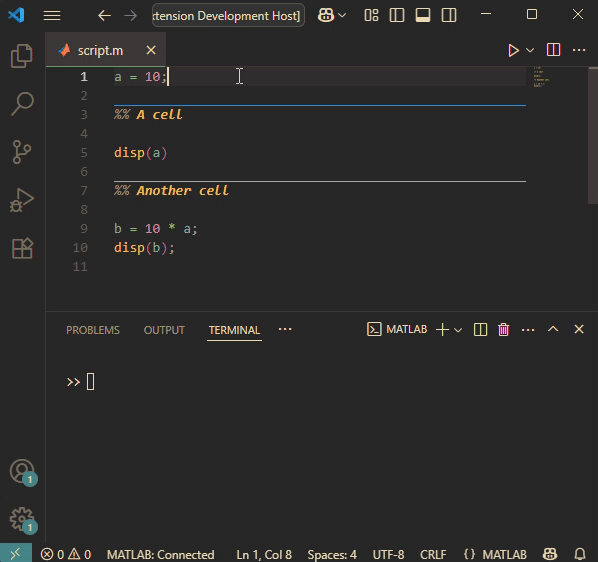

# MATLAB Run Cell in VS Code

This is an extension that adds MATLAB's `Run Cell` command to VS Code.

Under the hood, the command selects the current cell, and executes all lines with MATLAB's `Run Current Selection` command.

## Requirements

The official [MATLAB extension](https://marketplace.visualstudio.com/items?itemName=MathWorks.language-matlab) needs to be installed.

## Installation

Navigate to the Releases and download the `<release>.vsix` package file. Install in VS Code with `code --install-extension <release>.vsix`

## Extension Settings

Due to a quirk in MATLAB's `Run Current Selection` command, the editor loses focus when sending lines to the terminal.

This extension puts the editor back into focus after a configurable time-out (default 50 ms). The time-out can be changed in the option `matlab-run-cell.focusTimeOut`.

## Release Notes

### 1.0.0

Release date: 2025-06-27

- Initial release.
